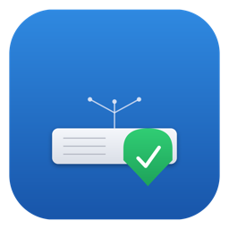

<p align="center">
  
</p>

<h1 align="center">Mac SMB Keeper</h1>

<p align="center">
  Native macOS menu bar app that keeps your SMB network shares connected.<br>
  Designed for headless Macs and always-on setups where dropped SMB mounts cause problems.
</p>

<p align="center">
  
  
  
</p>

## Features

- **Auto-reconnect** -- monitors configured SMB shares every 30 seconds and reconnects if dropped
- **Startup mount** -- automatically connects all enabled shares when the app launches
- **Launch at login** -- optionally start at boot for unattended/headless Macs (Settings > General)
- **Menu bar interface** -- lives in the menu bar with per-share status indicators (green/red/orange)
- **Keychain credentials** -- passwords stored securely in the macOS Keychain
- **Native mounting** -- uses the NetFS framework for proper macOS SMB mounts (same as Finder)
- **Drag and drop** -- drag `smb://` URLs into the window to quickly add shares
- **Multi-select** -- Cmd/Shift-click to select multiple shares for bulk connect, disconnect, or delete
- **Update checker** -- checks GitHub releases for new versions (Settings > Updates)
- **Built-in help** -- Help menu with getting started guide, shortcuts, and troubleshooting

## Installation

### Download

Grab the latest `.zip` from [Releases](https://github.com/eMacTh3Creator/MacSMBKeeper/releases), unzip, and drag **Mac SMB Keeper.app** to `/Applications`.

### Build from source

Requires Xcode 16+ and [xcodegen](https://github.com/yonaskolb/XcodeGen).

```bash
brew install xcodegen
./script/run.sh
```

The built app will be at `/tmp/MacSMBKeeper-build/Build/Products/Release/Mac SMB Keeper.app`.

## Usage

1. Launch Mac SMB Keeper -- it appears in the menu bar
2. Click the menu bar icon and select **Open Mac SMB Keeper...**
3. Click **+** or press **Cmd+N** to add an SMB share:
   - **Host**: IP address or hostname (e.g. `192.168.1.100` or `nas.local`)
   - **Share Name**: the SMB share name (e.g. `Media`)
   - **Mount Point**: where to mount (default `/Volumes`)
   - **Username/Password**: leave empty for guest access
   - **Auto-connect**: toggle whether this share reconnects automatically
4. The app monitors connections and reconnects dropped shares automatically

You can also drag an `smb://host/share` URL directly into the window to add it.

## Keyboard Shortcuts

| Shortcut | Action |
|----------|--------|
| Cmd+N | Add new share |
| Cmd+K | Connect all shares |
| Cmd+Shift+K | Disconnect all shares |
| Cmd+, | Open Settings |
| Cmd+/ | Show Help |
| Delete | Delete selected shares |

## Headless Mac Setup

Enable **Launch at Login** in Settings (Cmd+,) so Mac SMB Keeper starts automatically at boot and keeps your shares connected without manual intervention.

## Architecture

| Component | Description |
|-----------|-------------|
| `SMBMountService` | NetFS-based mount/unmount and mount detection via `statfs` |
| `SMBMonitorService` | 30-second polling loop with auto-reconnect |
| `KeychainService` | Secure credential storage via Security framework |
| `ShareStore` | JSON persistence in `~/Library/Application Support/MacSMBKeeper/` |
| `AppSettings` | Launch-at-login via SMAppService, GitHub update checker |

## Requirements

- macOS 15.0 (Sequoia) or later
- SMB shares accessible on the network

## License

MIT
